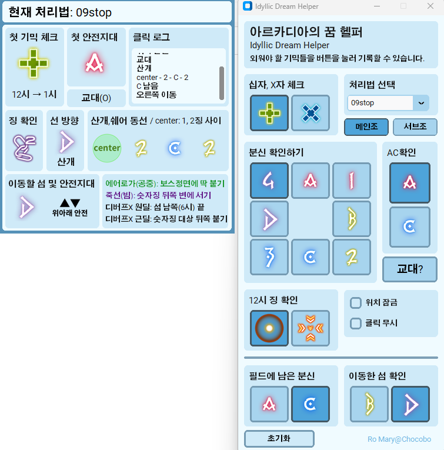

# Idyllic Dream Helper
파이널판타지14 황금의 유산 확장팩의 아르카디아 선수권: 헤비급 4(영웅) 후반전의 "아르카디아의 꿈" 기믹 처리를 돕는 툴입니다. 
버튼을 눌러 외워야 할 요소들을 기록하고 확인할 수 있습니다.

## 기능 및 사용법
*더블 모니터 사용을 가정하고 만들었습니다.*  
*현재 쉐어, 산개부분 징과 이동동선이 정확한지 테스트하고 있습니다...*  

 

- 창이 2개로 나뉘며, 버튼을 누르는 패널과 출력패널을 따로 드래그하여 옮길 수 있습니다. 
- 위치 잠금, 클릭 무시 기능을 이용하여 출력패널을 설정할 수 있습니다. 
- 처리법은 kr서버의 09stop, jp서버의 Game8 중 하나를 선택하여 사용할 수 있습니다. 
### 출력 패널에서 표시하는 것
- 첫 기믹 체크: 분신의 첫 생성이 십자인지, X자인지 확인합니다.
- 첫 안전지대: 심상세계에서의 첫 안전지대(A 또는 C)를 확인합니다.
- 교대: 심상세계의 타워에서 공격을 맞아 교대해야하는 상황인지 확인합니다. 기본값은 '교대 없음' 입니다.
- 징 확인: 공략법에서 사용하는 매크로의, 분신 위치에 따른 플레이어 표식을 나타냅니다.
- 선 방향: 본인이 선점하는 선 방향이 어느 바닥징 쪽인지 알려줍니다. **표시된 징 방향 분신 + 시계방향 1칸의 분신** 중 본인에게 맞는 선을 가져가면 됩니다. 
  - 예시1) B일 경우, 3시와 5시 분신을 의미합니다.
  - 예시2) C일 경우, 6시와 7시 분신을 의미합니다.
- 산개, 쉐어 동선: 12시의 쉐어, 산개 징과 본인의 분신 위치가 확인되면, 현실 세계에서의 쉐어, 산개를 처리할 때 본인이 가야하는 순서와 위치를 알려줍니다. 
  **정확한 위치가 아닌 방향만 대략적으로 알려주므로, 자세한 위치는 공략을 직접 확인해주세요.**
- 이동할 섬 및 안전지대: 첫 안전지대와 필드에 남은 분신, 이동할 섬이 확인되면, 이동할 섬 방향와 어느쪽으로 서야할지 표시합니다.
- 그 외: 심상세계 타워 처리 시, 피격당한 공격이나 디버프에 따른 기믹 처리 위치를 기록했습니다.
